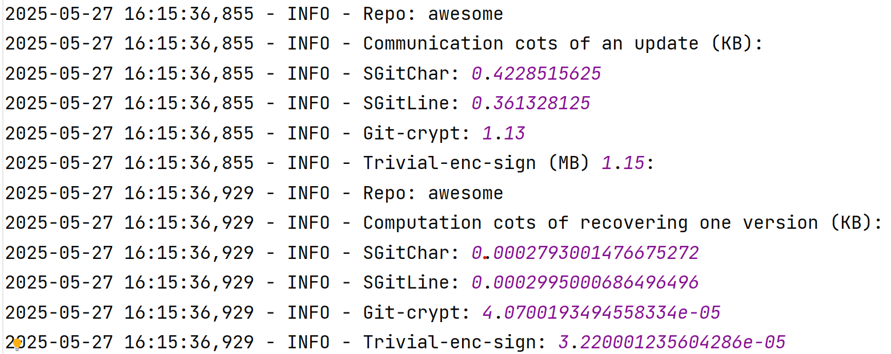

Paper title: **End-to-End Encrypted Git Services**

## Environment and dependencies:

We recommend to use the Windows system to evaluate the artifacts, since we conduct the performance evaluation on a Windows computer.

git version 2.47.1.windows.1 (choose install Git Bash in the pop-up window)
Please refer to https://git-scm.com/downloads.

Python 3.11.2

pip3 24.3.1

Make sure the required packages, including `GitPython`, `pycryptodome`, `cryptography`, and `diff-match-patch`, have been installed; if not, you can install them using the following commands: 

   1) `pip install GitPython`
   2) `pip install pycryptodome`
   3) `pip install cryptography`
   4) `pip install diff-match-patch`

## Setup instructions:

### Installation: 
1. First, download the artifact. There are two ways to access the artifact.
   
   1) Run `git clone https://github.com/yaqing16/SecureGit`.
   2) Download the `.zip` package from Zenodo and unpack the files into a folder called `SecureGit`.

3. Download the real repositories from Github by running the following commands in Git bash. 

   1) `cd .../SecureGit/dataset`
   2) `git clone https://github.com/sindresorhus/awesome.git`
   3) `git clone https://github.com/EbookFoundation/free-programming-books.git`
   4) `git clone https://github.com/twbs/bootstrap.git`
   5) `git clone https://github.com/facebook/react.git`
   6) `git clone https://github.com/freeCodeCamp/freeCodeCamp.git`
      
### Preparation:

Copy the Github token provided in Appdendix and paste it to the parameter $token$ in `SecureGit/src/lib/config.py`.

### Basic test: 

1) `cd .../SecureGit`

2) Run `python -m src.eval.basic_test`.

If successfully install, logs will be generated in `SecureGit/log/basic_test_log.log`, which are similar to those
shown below.

## E1: Experiment on communication costs of an update

### Instructions:

Make sure `output/test_upate_comm/{REPO}` is an empty folder.

Please navigate to the `SecureGit/` directory before running.

Run `python -m src.eval.test_update_comm --repo repo_name`, where the parameter `repo_name` can be 
set to `awesome`, `FPB`, `bootstrap`, `react`, and `FCC`, respectively. 

**Note:** Please comment out the following code in src/eval/test_update_comm.py, when running `python -m src.eval.test_update_comm --repo FCC`, 
to get the communication cost of SGitChar, SGitLine, and Git-crypt.
For Trivial-enc-sign, run `python -m src.eval.test_FCC_comm --index num`, where the parameter `num` is set to 0~9, respectively, 
to get the result of each commit. This is because the Trivial-enc-sign approach consumes too much memory and may cause 
the program to abort when the test is run in a loop.

    # Trivial
    trivial_upd_time = Init_for_Trivial(repository_path, repo_cipher_path_trivial, msg_upd)
    repo_trivial.git.branch('-M', 'trivial')
    repo_trivial.create_remote('origin', url)
    output_trivial, push_time_trivial = git_push_with_details(repo_cipher_path_trivial, 'trivial')
    print(output_trivial)
    comm_cost_trivial = get_pack_size(output_trivial)
    print(comm_cost_trivial)
    sum_trivial = sum_trivial + comm_cost_trivial

### Result: 
It will output the average communication costs for ten random updates of each repository under the four methods.

The result will be recorded in `evaluationlog/test_update_comm_log.log` and `evaluationlog/test_FCC_comm_log.log`.

## E2: Experiment on computation costs of an update

### Instructions:

Make sure `output/test_upate_comp/{REPO}` is an empty folder.

Please navigate to the `SecureGit/` directory before running.

Run `python -m src.eval.test_update_time --repo repo_name`, where the parameter `repo_name` can be 
set to `awesome`, `FPB`, `bootstrap`, `react`, and `FCC`, respectively.

### Result: 
It outputs the average computation costs for ten random updates of each repository. 

The result will be recorded in `evaluationlog/test_update_time_log.log`.

## E3: Experiment on storage costs

### Instructions:

Make sure `output/test_storage/{REPO}` is an empty folder.

Please navigate to the `SecureGit/` directory before running.

Run `python -m src.eval.test_storage --repo repo_name`, where the parameter `repo_name` can be 
set to `awesome`, `FPB`, `bootstrap`, `react`, and `FCC`, respectively.

### Result:
It outputs the size of the ciphertext repositories after 10, 20, 30, 40, 50 updates from the initial version.

The result will be recorded in `evaluationlog/test_storage_log.log`.

## E4: Experiment on computation costs of recovery

### Instructions:

First, test E2, as E4 takes E2's output as its input. 

Please navigate to the `SecureGit/` directory before running.

Run `python -m src.eval.test_recovery_time --repo repo_name`, where the parameter `repo_name` can be 
set to `awesome`, `FPB`, `bootstrap`, `react`, and `FCC`, respectively.

### Result:

It outputs the average computation costs of recovering one version of each repository. 

The result will be recorded in `evaluationlog/test_recovery_log.log`.

## Other experiments

### Instructions:

Please navigate to the `SecureGit/` directory before running.

Run `python -m src.eval.test_init --repo repo_name`, where the parameter `repo_name` can be 
set to `awesome`, `FPB`, `bootstrap`, `react`, and `FCC`, respectively.

### Result:

It outputs the average computation and communication costs of initializing the first version of each repository. 

The result will be recorded in `evaluationlog/test_init_log.log`.

### Instructions of creating the figures

Please navigate to the `SecureGit/` directory before running. 

Run `python -m src.pic.pic_reponame`, where the parameter `reponame` can be 
set to `awesome`, `FPB`, `bootstrap`, `react`, and `FCC`, respectively.

### Result:

It will present the figures that show the stroage costs.

The figures will be stored in `pic/`.

## Instructions for result analysis

For clarity, our experiment results are provided in the `.log` files in the `log` folder, and the logs of artifact evaluation
results will be recorded in the `evaluationlog` folder. 

Due to differences in machine specifications (e.g., CPU, memory, disk I/O, or network performance), the exact numerical results obtained 
when running the artifact may vary slightly across different environments. 
However, the relative comparison between key experimental results should remain consistent. Therefore, the main claims can be verified 
by checking whether the relative ordering or trends observed in experiments match those reported in the paper.

## Note:

During execution, users may encounter a warning message similar to:

    Exception ignored in: <function Popen.__del__ at 0x...>
    RuntimeError: cannot join current thread

This warning is raised by Python's internal `subprocess` module during garbage collection, 
typically when a `Popen` object is deleted while the interpreter is shutting down. 
It is a known benign issue that can occur in some Python versions and does not affect the correctness or 
output of the experiments. Users can safely ignore this message.
